# Plant UML Diagramming

The purpose of this document is to provide an overview for using PlantUML as an efficient method for generating architecture diagrams. It intentionally forgoes some standard diagramming styles in favor of efficiency.

Please visit the official PlantUML documentation:

> https://plantuml.com

# Setup

## VS Code Extension

The VS Code extension uses either a PlantUML server or a local version of the PlantUML .jar file. This repository includes everything necessary to run a PlantUML server in Docker, eliminating the need to install PlantUML, Graphviz and Java.

### Installation

In VS Code Extensions, install the PlantUML extension by jebbs.

> https://marketplace.visualstudio.com/items?itemName=jebbs.plantuml

### Settings

The recommended VS Code PlantUML extension user/workspace settings are shown below. It's recommended that the following settings be added to your User workspace settings.

```
{
    "plantuml.commandArgs": [],
    "plantuml.diagramsRoot": "./docs/diagrams/src",
    "plantuml.exportOutDir": "./docs/diagrams/out",
    "plantuml.exportFormat": "png",
    "plantuml.lintDiagramNoName": true,
    "plantuml.previewAutoUpdate": true,
    "plantuml.exportSubFolder": false,
    "plantuml.server": "http://localhost:8080",
    "plantuml.render": "PlantUMLServer",
    "plantuml.urlResult": "MarkDown"
    }
}
```

## PlantUML Server and Library Files

> You willl need Docker installed.
>
> https://www.docker.com/products/docker-desktop

This is a simple PlantUML server that is ran using Docker, eliminating the need to install PlantUML, Graphviz and Java.

In addition to the server, this repository includes libraries that assist in the creation of visually consistent diagrams.

### Start the PlantUML Server

In a new terminal and from the root of the repository, run the following to start the PlantUML server and then access the server on port `8080`.

> docker run -p 8080:8080 plantuml/plantuml-server:tomcat-v1.2022.6
>
>OR
>
> sh plantuml.sh

> http://localhost:8080

### Start the PlantUML Library Server

In a new terminal and from the root of the repository, run the following to start the PlantUML library server and then access the server on port `8000`.

> python3 lib-server.py 8000
>
> OR
>
> sh libs.sh

> http://localhost:8000

## Examples

Examples of various diagram types are included in the repository docs/diagrams/src folder. For rendering consistency, each of the examples include the libraries.

# Repository Folder Structure

In your repo, ensure that the following folder structure exists:

```
Repository Root
  - docs
    - diagrams
      - src
      - out
```

Run the following script to generate the folder structure.

`sh create-docs-folders.sh`

> Multiple .puml files can exist in the src folder. While the PlantUML spec does allow for multiple diagrams in the same file, please keep each diagram in a separate file, named uniquely according to its purpose.

# File Naming Convention

In the architecture/diagrams/src folder, create a brand new file using the following convention. It must end in `.sequence.puml`, `.level-1.puml`, `.level-2.puml`, `.level-3.puml` or `.data.puml`. The string before the file extension immediately tells us the type of diagram and .puml is our chosen standard extension for the file type. The name must be lowercase and use hyphens for spaces. Choose a name that accurately portrays what the diagram is for. Here are some examples:

> getting-started.level-1.puml

> serverless-deployment-pipeline.sequence.puml

# Previewing Your Diagram

To preview your diagram in VS Code, right-click anywhere in the text portion of your .puml file. In the context menu, click Preview Current Diagram. This will launch a new tab in VS Code and render your diagram. With this tab preview open, your diagram will automatically update with changes. I would recommend leaving this open as you create your sequence diagram.

# Exporting Your Diagram

To export your diagram in VS Code, right-click anywhere in the text portion of your .puml file. In the context menu, click Export Current Diagram. Assuming you've set up the PlantUML extension workspace settings, this will generate a named .png file in the architecture/diagrams/out folder in your repo.

Pull requests to the repo must contain both the .puml files in the docs/diagrams/src folder as well as the generated .png files in the docs/diagrams/out. Pull requests that are missing the source or .png files should be declined.

# Diagram Components

Below is a typical blank level-1 diagram. The file is named my-system.level-1.puml. Let's take a look at each area.

```
@startuml
!include http://host.docker.internal:8000/level_lib.puml

title My System
header Our Fabulous Product
footer 8/11/2022 \nLibrary: $version\n PlantUML: %version()

@enduml
```

Line 1 contains the opening tag of the diagram - @startuml.

Line 2 contains a standard library to help ensure consistency across all diagrams.

Line 4 contains the title of the diagram. This will appear at the top of your generated diagram.

Line 5 contains an optional header. This is a good way to visually associate several diagrams with a product or service.

Line 6 contains the last updated data of the diagram.

Line 8 contains the closing tag of the diagram - @enduml

The include files should not exist locally. We want to be able to add to and improve it over time without requiring updates to each repo. Make sure that you are using the libraries via:

```
!include http://host.docker.internal:8000/level_lib.puml
```

The above diagram would generate a file named `my-system.level-0.png` that would render as follows:

<p align="center">
  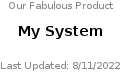
</p>

# Libraries

To help ensure consistency for diagrams, libraries were created for the level, sequence and data diagrams. Supported libraries are:

* level_lib.puml - For level-1, level-2 and level-3 diagrams.
* sequence_lib.puml - For sequence diagrams.
* data_lib.puml - For data structures.

These libraries are included in this repository.

Iconography is intentionally left out of the diagrams as it can change without notice leaving the diagrams looking dated.

Each component in the library supports 4 properties:

* Reference - This is not for visual purposes, but used to reference the component in the diagram itself. These must be unique for each component in the diagram.
* Service - Think of this as a specific AWS service, such as EventBridge. This can be used to show generic lambda usage in your diagram.
* Name - This is the specific implementation of that service, for example, my-custom-rule.
* Metadata - This is optional data that may help to convey information regarding your service.

Below shows how each property is rendered:

<p align="center">
  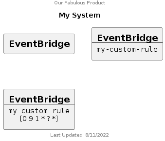
</p>

Here is the corresponding .puml file for it:

```
@startuml
!include http://host.docker.internal:8000/level_lib.puml

title My System
header Our Fabulous Product
footer 8/11/2022 \nLibrary: $version\n PlantUML: %version()

Generic(MyGenericService1, "EventBridge")
Generic(MyGenericService2, "EventBridge", "my-custom-rule")
Generic(MyGenericService3, "EventBridge", "my-custom-rule", "[0 9 1 * ? *]")

@enduml
```

The following components are supported in the level and sequence diagrams:

* Actor
* Generic
* Lambda
* S3
* SSM
* EventBridge
* StepFunction
* Database
* Cloud

The following are additional components specific to level diagrams:

* VPC
* SecurityGroup
* AvailabilityZones

The above diagram uses a Generic component to clearly show how the properties are used, however, in our case, EventBridge is a supported component, so could be written as follows:

```
@startuml
!include http://host.docker.internal:8000/level_lib.puml

title My System
header Our Fabulous Product
footer 8/11/2022 \nLibrary: $version\n PlantUML: %version()

EventBridge(MyGenericService1)
EventBridge(MyGenericService2, "my-custom-rule")
EventBridge(MyGenericService3, "my-custom-rule", "[0 9 1 * ? *]")

@enduml
```

The above diagram is a level diagram. By simply changing line 2 to reference the sequence library - `!include http://host.docker.internal:8000/sequence_lib.puml`, we change the rendering:

<p align="center">
  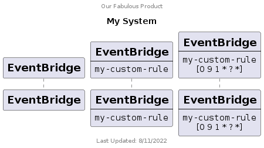
</p>

# Creating a Diagram

The diagram types that are current supported in this spec include level-1, level-2, level-3 and sequence. These values are appended to file names with `.`. Not all are required but each provide a different level of detail for the system and architecture. Our focus in Engineering is to ensure that we have at least Level-2 and Sequence diagrams for all services and a level 3 diagram(s) for security and networking documentation.

## Level Diagrams

The syntax for the library components for level and sequence diagrams are identical, however, there are some subtle differences in the diagrams. The main difference in diagrams is the arrows. You can use the same -> arrows, however, GraphViz will attempt to automatically position you components. For more control, you can use -up-> -down-> -left-> -right->. The diagram below was created using the same -> arrow for all connections.

<p align="center">
  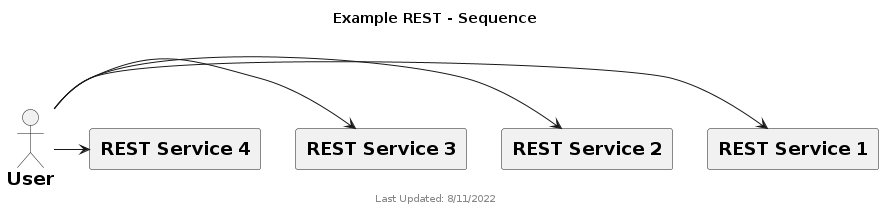
</p>

```
@startuml
!include http://host.docker.internal:8000/level_lib.puml

title "Example REST - Sequence"
footer 8/11/2022 \nLibrary: $version\n PlantUML: %version()

Actor(User, "User")
Generic(RESTService1, "REST Service 1")
Generic(RESTService2, "REST Service 2")
Generic(RESTService3, "REST Service 3")
Generic(RESTService4, "REST Service 4")

User -> RESTService1
User -> RESTService2
User -> RESTService3
User -> RESTService4
 
@enduml
```

Here is the same components using different arrows for better positioning:

<p align="center">
  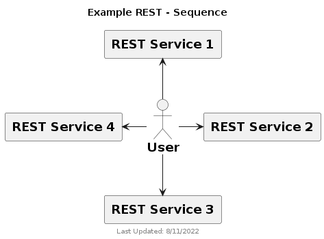
</p>

```
@startuml
!include http://host.docker.internal:8000/level_lib.puml

title "Example REST - Sequence"
footer 8/11/2022 \nLibrary: $version\n PlantUML: %version()

Actor(User, "User")
Generic(RESTService1, "REST Service 1")
Generic(RESTService2, "REST Service 2")
Generic(RESTService3, "REST Service 3")
Generic(RESTService4, "REST Service 4")

User -up-> RESTService1
User -right-> RESTService2
User -down-> RESTService3
User -left-> RESTService4
 
@enduml
```

## Level-1

Level 1 is a high-level view of your service intended to give the viewer a quick overview of the main components of the system and how they are connected. It needs to quickly show how the system is invoked (api, cron, etc), the primary system types in the service (ECS, lambda, etc) as well as external components are involved (database, integration service, vendor, etc). This diagram should be quick and simple. If the system uses ECS and 10 lambdas that connect to the database, simply show one ECS reference, one lambda reference and who calls the database. At this level, we don't need to know networking or the security if the service. Further details can be found in level 3.

<p align="center">
  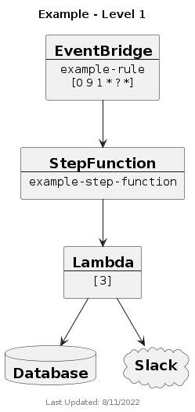
</p>

```
@startuml
!include http://host.docker.internal:8000/level_lib.puml

title "Example - Level 1"
footer 8/11/2022 \nLibrary: $version\n PlantUML: %version()

EventBridge(EventBridge, "example-rule", "[0 9 1 * ? *]")
StepFunction(StepFunction, "example-step-function")
Lambda(Lambda, "[3]")
Database(Database, "Database")
Cloud(Slack, "Slack")

EventBridge -down-> StepFunction
StepFunction -down-> Lambda
Lambda -down-> Database
Lambda -down-> Slack

@enduml
```

## Level-2

Level 2, shows how your system communicates to each individual AWS services. For example, show communication to lambda, in general. If your system uses 10 lambdas, show and label each of them. This level (and sequence) is the most useful for Engineering as it shows all of the individual components used in the service allowing them to quickly understand all of the moving parts of the system. At this level, we don't need to know networking or the security if the service. Further details can be found in level 3.

<p align="center">
  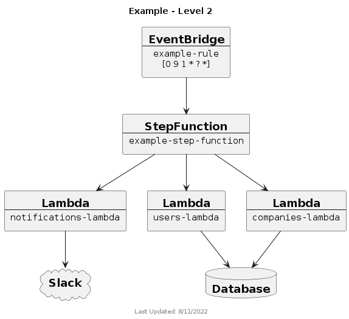
</p>

```
@startuml
!include http://host.docker.internal:8000/level_lib.puml

title "Example - Level 2"
footer 8/11/2022 \nLibrary: $version\n PlantUML: %version()

EventBridge(EventBridge, "example-rule", "[0 9 1 * ? *]")
StepFunction(StepFunction, "example-step-function")
Lambda(NotificationsLambda, "notifications-lambda")
Lambda(UsersLambda, "users-lambda")
Lambda(CompaniesLambda, "companies-lambda")
Database(Database, "Database")
Cloud(Slack, "Slack")

EventBridge -down-> StepFunction
StepFunction -down-> NotificationsLambda
StepFunction -down-> UsersLambda
StepFunction -down-> CompaniesLambda
UsersLambda -down-> Database
CompaniesLambda -down-> Database
NotificationsLambda -down-> Slack

@enduml
```

## Level-3

Level 3 is the most detailed. It should show detailed networking including vpc, availability zones, security groups, peering connections, etc. We should be able to see what ports are open, determine security risks, etc. This level is the most useful for Security and Ops as it shows all of the individual components used in the service allowing them to quickly understand all of the networking and security of the system.

<p align="center">
  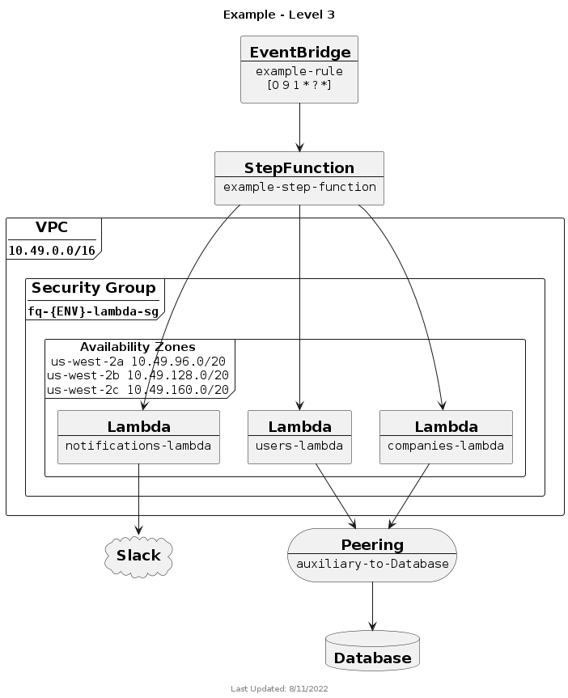
</p>

```
@startuml
!include http://host.docker.internal:8000/level_lib.puml

title "Example - Level 3"
footer 8/11/2022 \nLibrary: $version\n PlantUML: %version()

EventBridge(EventBridge, "example-rule", "[0 9 1 * ? *]")
StepFunction(StepFunction, "example-step-function")
Database(Database, "Database")
Cloud(Slack, "Slack")
Peering(DatabasePeering, "auxiliary-to-Database")

!$AZs = { "list": [
        { "name": "us-west-2a", "value": "10.49.96.0/20" },
        { "name": "us-west-2b", "value": "10.49.128.0/20" },
        { "name": "us-west-2c", "value": "10.49.160.0/20" }
    ]
}

VPC("Auxiliary", "10.49.0.0/16") {
    SecurityGroup(AuxSG, "co-{ENV}-lambda-sg") {
        AvailabilityZones(AZs, $AZs) {
            Lambda(NotificationsLambda, "notifications-lambda")

            Lambda(UsersLambda, "users-lambda")

            Lambda(CompaniesLambda, "companies-lambda")
        }
    }
}

EventBridge -down-> StepFunction
StepFunction -down-> NotificationsLambda
StepFunction -down-> UsersLambda
StepFunction -down-> CompaniesLambda
UsersLambda -down-> DatabasePeering
CompaniesLambda -down-> DatabasePeering
DatabasePeering -down-> Database
NotificationsLambda -down-> Slack

@enduml
```

## Sequence

The sequence diagram shows how your system components interact with each other. It should correctly show conditionals, loop, etc as well as both success and error responses of the service.

A few things to note about this diagram:

* It doesn’t follow all of the UML sequence diagram standards. For example, in the UML standard, response arrows are dashed. Our goal is to keep this diagramming process efficient. We simply use -> and <-. Requiring a specific arrow type increases the complexity of our standard, which we want to remain simple.
* It is mostly a happy path only. The majority of error handling isn’t shown. Additional error handling could be shown in the diagram, however, to ensure that the system is fully thought out.

<p align="center">
  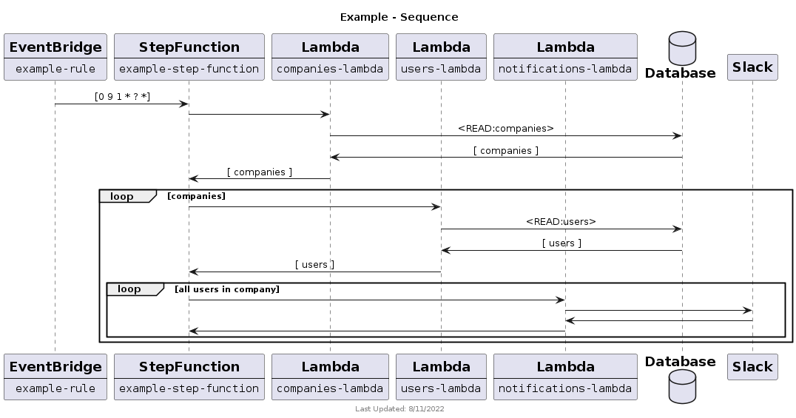
</p>

```
@startuml
!include http://host.docker.internal:8000/sequence_lib.puml

title "Example - Sequence"
footer 8/11/2022 \nLibrary: $version\n PlantUML: %version()

EventBridge(EventBridge, "example-rule")
StepFunction(StepFunction, "example-step-function")
Lambda(CompaniesLambda, "companies-lambda")
Lambda(UsersLambda, "users-lambda")
Lambda(NotificationLambda, "notifications-lambda")
Database(Database)
Cloud(Slack, "Slack")

EventBridge -> StepFunction : [0 9 1 * ? *]

StepFunction -> CompaniesLambda
    CompaniesLambda -> Database : <READ:companies>
    CompaniesLambda <- Database : [ companies ]
StepFunction <- CompaniesLambda : [ companies ]

loop companies
    StepFunction -> UsersLambda
        UsersLambda -> Database : <READ:users>
        UsersLambda <- Database : [ users ]
    StepFunction <- UsersLambda : [ users ]

    loop all users in company
        StepFunction -> NotificationLambda
            NotificationLambda -> Slack
            NotificationLambda <- Slack
        StepFunction <- NotificationLambda
    end
end

@enduml
```

A couple of things to note in the sequence diagram are as follows:

Calls to the Database show the method and table accessed

* <READ:tableName>
* <WRITE:tableName>
* <DELETE:tableName>

Calls to the Database show the type of data in the query response such as an array or single object

* [ companies ]
* { company }

The use of loop is a type of group that can be important to see potential bottlenecks or other issues that may impact performance, like throttling.

### Additional Groups

In addition to loop, which is built into PlantUML and not a part of the libraries, are additional groups that help in conveying how your system works.

#### Parallel Executions

The following diagram shows the companies-lambda looping through all of the companies and making parallel invocations of the users-lambda.

<p align="center">
  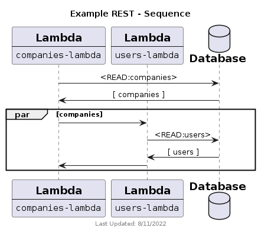
</p>

```
@startuml
!include http://host.docker.internal:8000/sequence_lib.puml

title "Example REST - Sequence"
footer 8/11/2022 \nLibrary: $version\n PlantUML: %version()

Lambda(CompaniesLambda, "companies-lambda")
Lambda(UsersLambda, "users-lambda")
Database(Database, "Database")

CompaniesLambda -> Database : <READ:companies>
CompaniesLambda <- Database : [ companies ]
 
par companies
   CompaniesLambda -> UsersLambda
       UsersLambda -> Database : <READ:users>
       UsersLambda <- Database : [ users ]
   CompaniesLambda <- UsersLambda
end
 
@enduml
```

#### If/Else

The following diagram shows both the success and error during a login. If the login is successful, the response is a 302 that redirects to the application page. If the login fails, the service responds with a 401.

<p align="center">
  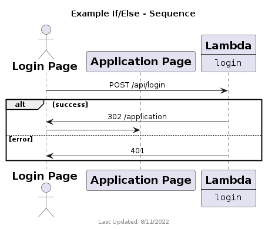
</p>

```
@startuml
!include http://host.docker.internal:8000/sequence_lib.puml

title "Example If/Else - Sequence"
footer 8/11/2022 \nLibrary: $version\n PlantUML: %version()

Actor(LoginPage, "Login Page")
Generic(ApplicationPage, "Application Page")
Lambda(LoginLambda, "login")
 
LoginPage -> LoginLambda : POST /api/login
 
alt success
   LoginPage <- LoginLambda : 302 /application
   LoginPage -> ApplicationPage
else error
   LoginPage <- LoginLambda : 401
end
 
@enduml
```

## REST Sequence
In the case of a REST API, the request should show the method and endpoint. For responses, the values are handled similar to a database query, referencing an array of data or a single object. Additionally, an HTTP response code can be used.

<p align="center">
  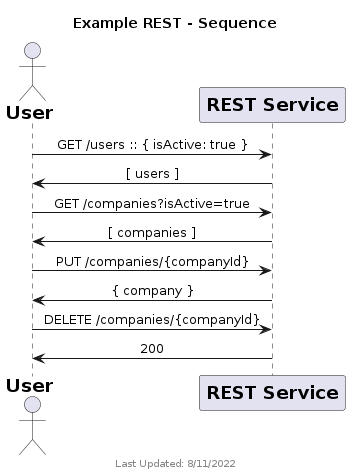
</p>

```
@startuml
!include http://host.docker.internal:8000/sequence_lib.puml

title "Example REST - Sequence"
footer 8/11/2022 \nLibrary: $version\n PlantUML: %version()

Actor(User, "User")
Generic(RESTService, "REST Service")
 
User -> RESTService : GET /users :: { isActive: true }
User <- RESTService : [ users ]
User -> RESTService : GET /companies?isActive=true
User <- RESTService : [ companies ]
User -> RESTService : PUT /companies/{companyId}
User <- RESTService : { company }
User -> RESTService : DELETE /companies/{companyId}
User <- RESTService : 200
 
@enduml
```

## Data
The data diagram shows how your database collections/tables are related.

A few things to note about this diagram:

This does not currently support complex JSON structures.

Foreign keys should reference the collection dot the key

Arrows should point to the collection/table that is referenced.

<p align="center">
  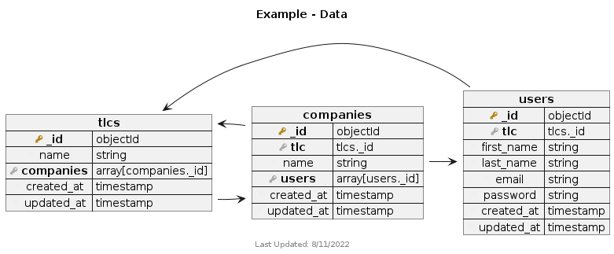
</p>

```
@startuml
!include http://host.docker.internal:8000/data_lib.puml

title "Example - Data"
footer 8/11/2022 \nLibrary: $version\n PlantUML: %version()

Collection( tlcs ) {
  PrimaryKey( _id, objectId )
  Field( name, string )
  ForeignKey( companies, array[companies._id] )
  Field( created_at, timestamp )
  Field( updated_at, timestamp )
}

Collection( companies ) {
  PrimaryKey( _id, objectId )
  ForeignKey( tlc, tlcs._id )
  Field( name, string )
  ForeignKey( users, array[users._id] )
  Field( created_at, timestamp )
  Field( updated_at, timestamp )
}

Collection( users ) {
  PrimaryKey( _id, objectId )
  ForeignKey( tlc, tlcs._id )
  Field( first_name, string )
  Field( last_name, string )
  Field( email, string )
  Field( password, string )
  Field( created_at, timestamp )
  Field( updated_at, timestamp )
}

tlcs::companies -> companies::_id
companies::tlc -> tlcs::_id
companies::users -> users::_id
users::tlc -> tlcs::_id

@enduml
```

## Embedding a Diagram

Once you’ve generated your diagram ./architecture/diagrams/out, you can using the adr-embed snippet to generate simple HTML for embedding in your README files. Simply complete the path to the appropriate file.

```
<p align="center">
  
</p>
```

